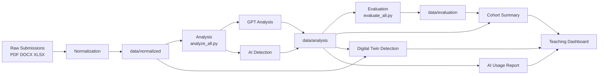

# Assessment Pipeline

## Motivation

University assignments increasingly arrive as heterogeneous collections of
documents rather than as a single, consistently structured file. Reviewing
these submissions manually is time-consuming, difficult to reproduce at cohort
scale, and makes it harder to compare task completion, evidence quality, AI
usage declarations, and emerging concepts such as Digital Twin adoption.

This project provides a reproducible assessment pipeline for the UPM MSc in
AI Management assignment workflow. It converts Moodle submissions into a
canonical machine-readable representation, combines deterministic text
processing with structured GPT-OSS analysis, evaluates the resulting records,
and produces compact reports for cohort-level teaching insight.

The goal is not to replace academic judgement. The pipeline is an evidence
organization and screening tool: it makes relevant signals easier to inspect,
compare, and discuss while preserving the distinction between automated
classification and a teacher's final assessment.

## What the application does

The pipeline processes PDF, DOCX, XLSX, PPTX, text, CSV, Markdown, and HTML
content found in Moodle submission folders. It can:

- discover and extract files from student submissions and archives;
- normalize each submission into a student-level JSON record;
- identify assignment tasks and estimate task-section coverage;
- classify submission structure, assignment type, completeness, and issues;
- evaluate analysis records for quality, evidence strength, and confidence;
- detect explicit textual mentions of AI tools;
- identify Digital Twin mentions and recommendation signals;
- aggregate individual records into CSV files suitable for a teaching dashboard.

## Pipeline overview



## Generated data products

The stages communicate through files so that each step can be inspected and
rerun independently:

| Path | Purpose |
| --- | --- |
| `data/normalized/` | Canonical per-student submissions with extracted text and metadata. |
| `data/analysis/` | Structured GPT-OSS analysis enriched with deterministic AI-use detection. |
| `data/evaluation/` | Quality and evidence evaluations derived from analysis records. |
| `data/cohort_summary.csv` | Joined cohort-level analysis and evaluation metrics. |
| `data/dt_adoption.csv` | Digital Twin status and supporting evidence excerpts. |
| `data/ai_usage_report.csv` | Explicit AI-use declarations, detected tools, and evidence. |

The repository currently generates dashboard-ready data products; a dashboard
application is a downstream consumer rather than part of this package.

## Running the pipeline

The project targets Python 3.12 and uses Poetry for dependency management:

```bash
poetry install
poetry run python -m assessment_pipeline.process_all
poetry run python -m assessment_pipeline.analyze_all
poetry run python -m assessment_pipeline.evaluate_all
poetry run python -m assessment_pipeline.cohort_summary
poetry run python -m assessment_pipeline.dt_adoption
poetry run python -m assessment_pipeline.ai_usage_report
```

Run the stages in the order shown above. The analysis and evaluation stages
require access to the configured local GPT-OSS/Ollama endpoint. The reporting
stages use the JSON products already written by earlier stages and can be
rerun without reprocessing the original submissions.

## Methodological boundaries

The GPT-OSS stage receives a reduced submission payload to control prompt size,
while deterministic AI-tool and Digital Twin detection operate on the full
normalized text. AI-use detection identifies explicit textual mentions; it is
not authorship attribution and cannot prove undisclosed use. Digital Twin
detection is a rule-based adoption signal, not a semantic evaluation of the
quality of a proposal. All automated results should therefore be reviewed in
context by teaching staff.

## Documentation and tests

The English Sphinx documentation describes the architecture and public Python
API:

```bash
poetry run sphinx-build -b html docs docs/_build/html
```

The test suite covers parsers, normalization, archive handling, task
detection, reporting-related components, and Moodle processing:

```bash
poetry run pytest
```
